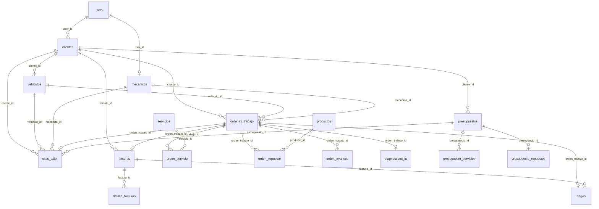

# Documentación de consultas a la base de datos — Autofix

Documento de referencia sobre **todas las consultas** que el proyecto realiza a PostgreSQL (vía Eloquent / Query Builder), el **esquema actual**, los **índices existentes** y las **recomendaciones** de índices, triggers, constraints y otras optimizaciones.

> Motor asumido: **PostgreSQL** (uso de `ilike`, extensión `pgcrypto`, UUID).
> Acceso a datos: **Active Record** en controladores y servicios. No hay capa de repositorios implementada.

---

## Tabla de contenidos

1. [Resumen arquitectónico](#1-resumen-arquitectónico)
2. [Mapa de tablas y relaciones](#2-mapa-de-tablas-y-relaciones)
3. [Índices y constraints existentes](#3-índices-y-constraints-existentes)
4. [Consultas por módulo](#4-consultas-por-módulo)
5. [Consultas de servicios transversales](#5-consultas-de-servicios-transversales)
6. [Consultas de reportes y dashboard](#6-consultas-de-reportes-y-dashboard)
7. [¿Hace falta crear triggers?](#7-hace-falta-crear-triggers)
8. [Índices recomendados](#8-índices-recomendados)
9. [Otras recomendaciones de esquema](#9-otras-recomendaciones-de-esquema)
10. [Priorización](#10-priorización)

---

## 1. Resumen arquitectónico

| Aspecto | Situación actual |
|--------|------------------|
| ORM | Eloquent (Laravel) |
| Persistencia | Controladores + `app/Services` + servicios de Application |
| Repositorios | No implementados (`RepositoryServiceProvider` vacío) |
| Transacciones | `DB::transaction()` en OT, factura, cita→OT, presupuesto, diagnóstico IA, portal |
| Concurrencia | `lockForUpdate()` solo en stock de productos |
| Soft deletes | No se usan |
| Observers / Events de dominio | No hay; notificaciones Laravel escriben en `notifications` |
| Numeración | Prefijo diario + `LIKE` + `ORDER BY DESC` en OT / factura / presupuesto |

### Patrones de consulta recurrentes

| Patrón | Dónde aparece |
|--------|----------------|
| Listado paginado (`paginate` + `withQueryString`) | OT, clientes, productos, usuarios, presupuestos, diagnósticos, facturas, pagos |
| Eager loading `with([...])` | OT, facturas, pagos, citas, diagnósticos, historial |
| Filtro por rol (mecánico → `mecanico_id`; cliente → `cliente_id` / `user_id`) | Dashboard, OT, citas, portal, diagnósticos |
| Búsqueda texto `ilike '%q%'` o `LOWER(...) LIKE` | Usuarios, inventario, presupuestos, historial, servicios, mecánicos (IA) |
| Anti-join `whereDoesntHave` / `exists()` | OT sin pago, OT sin IA, producto en uso, cliente con vehículos |
| Numeración secuencial diaria | `generarNumero()` en OT, Factura, Presupuesto |
| Stock con bloqueo | `OrdenRepuestoStockService` |

---

## 2. Mapa de tablas y relaciones



### Tablas de dominio

| Tabla | PK | Propósito |
|-------|----|-----------|
| `users` | uuid | Auth, roles (`admin`, `recepcionista`, `mecanico`, `cliente`), activo |
| `clientes` | uuid | Ficha de cliente; opcional `user_id` para portal |
| `vehiculos` | uuid | Flota por cliente; placa única |
| `mecanicos` | uuid | Perfil técnico; opcional `user_id` |
| `servicios` | uuid | Catálogo de mano de obra |
| `productos` | uuid | Catálogo / inventario (repuestos) |
| `ordenes_trabajo` | uuid | Núcleo operativo del taller |
| `orden_servicio` | uuid | Líneas de servicio de una OT |
| `orden_repuesto` | uuid | Líneas de repuesto; descuenta stock |
| `orden_avances` | uuid | Bitácora de avances por OT |
| `diagnosticos_ia` | uuid | 1:1 con OT; sugerencias IA |
| `facturas` / `detalle_facturas` | uuid | Facturación 1:1 con OT |
| `pagos` | uuid | Cobro 1:1 con OT (y opcionalmente factura) |
| `citas_taller` | uuid | Agenda del taller |
| `presupuestos` + líneas | uuid | Cotizaciones portal/staff |
| `notifications` | uuid | Notificaciones Laravel (morph UUID) |
| `personal_access_tokens` | uuid | Sanctum API |
| `sessions` / `cache` / `jobs` | — | Infra Laravel |

---

## 3. Índices y constraints existentes

### Uniques

| Tabla | Columna(s) |
|-------|------------|
| `users` | `email` |
| `clientes` | `numero_documento`, `email` |
| `vehiculos` | `placa` |
| `mecanicos` | `documento` |
| `servicios` | `nombre` |
| `productos` | `codigo` |
| `ordenes_trabajo` | `numero` |
| `diagnosticos_ia` | `orden_trabajo_id` |
| `facturas` | `numero`, `orden_trabajo_id` |
| `pagos` | `orden_trabajo_id`, `factura_id` |
| `presupuestos` | `numero` |
| `personal_access_tokens` | `token` |

### Índices explícitos (además de PK / FK implícitas)

| Tabla | Índice |
|-------|--------|
| `citas_taller` | `(fecha_hora, estado)`, `mecanico_id`, `cliente_id` |
| `presupuestos` | `(cliente_id, estado)` |
| `orden_avances` | `(orden_trabajo_id, created_at)` |
| `sessions` | `user_id`, `last_activity` |
| `personal_access_tokens` | `expires_at`, morph `tokenable` |
| `jobs` | `queue` |
| `notifications` | morph `notifiable` |

### Foreign keys relevantes

- Cascada al borrar OT → líneas servicio/repuesto, avances, diagnóstico, factura, pago.
- Cascada al borrar cliente → vehículos, OT, citas, presupuestos, facturas.
- `restrictOnDelete` en líneas de presupuesto hacia `servicios` / `productos`.
- `nullOnDelete` en mecánico / usuario / presupuesto enlazado a cita.

---

## 4. Consultas por módulo

Para cada consulta se indica: **operación**, **tablas**, **condiciones**, **archivo** y **necesidad de índice / trigger**.

### 4.1 Auth / Usuarios

| # | Operación | Consulta (resumen) | Archivo | Índice / nota |
|---|-----------|--------------------|---------|---------------|
| A1 | SELECT | Login por `email` | `AuthController`, `WebAuthController` | Cubierto por `UNIQUE(email)` |
| A2 | INSERT | Registro de usuario | Auth controllers | — |
| A3 | SELECT | Listado usuarios: `orderBy(name)`, filtro `role`, `ilike` name/email, paginate 50 | `UsuarioWebController@index` | Índice `(activo, role)` útil para notifiers; texto → ver trgm |
| A4 | SELECT | `selectRaw('role, COUNT(*) … GROUP BY role')` | `UsuarioWebController` | Table scan aceptable (pocos users) |
| A5 | INSERT/UPDATE/DELETE | CRUD usuarios | `UsuarioWebController` | — |
| A6 | INSERT | Tokens Sanctum | Sanctum | Índices morph / token OK |

### 4.2 Clientes

| # | Op | Consulta | Archivo | Índice / nota |
|---|----|----------|---------|---------------|
| C1 | SELECT | `Cliente::paginate` / `all` | `ClienteWebController`, API | OK por PK |
| C2 | INSERT/UPDATE | Alta / edición | Controllers | Uniques documento/email |
| C3 | SELECT | `vehiculos()->exists()` antes de borrar | `ClienteWebController@destroy` | FK `vehiculos.cliente_id` |
| C4 | SELECT/INSERT/UPDATE | Vincular o crear cliente por `user_id` / email | `ClienteCuentaService` | **Recomendado:** índice explícito `clientes(user_id)` |
| C5 | SELECT | Portal: cliente por `user_id` | `PortalClienteWebController` | Mismo índice `user_id` |
| C6 | SELECT | `where('estado', true)` (dashboard, options) | Varios | Índice parcial `WHERE estado = true` opcional |

### 4.3 Vehículos

| # | Op | Consulta | Archivo | Índice / nota |
|---|----|----------|---------|---------------|
| V1 | SELECT | Listado `with('cliente')` | `VehiculoWebController` | FK `cliente_id` |
| V2 | INSERT/UPDATE/DELETE | CRUD | Controllers | Unique `placa` |
| V3 | SELECT | Options: activos por cliente | Formularios OT/citas | Índice `(cliente_id, activo)` recomendable |
| V4 | SELECT | Historial: búsqueda `LOWER(placa\|marca\|modelo) LIKE` + `orWhereHas` cliente | `HistorialWebController` | **pg_trgm** en placa/marca/modelo |
| V5 | SELECT | `withCount('ordenesTrabajo')` | Historial | FK OT `vehiculo_id` |

### 4.4 Mecánicos

| # | Op | Consulta | Archivo | Índice / nota |
|---|----|----------|---------|---------------|
| M1 | SELECT | Listado / CRUD | Controllers | Unique `documento` |
| M2 | SELECT | Users role=mecánico sin perfil asignado | `MecanicoWebController` | Índice `(role)` o `(activo, role)` en `users` |
| M3 | SELECT | Activos para options / IA | Varios, `GroqDiagnosticService` | Índice `activo`; especialidad con `LIKE` → trgm |
| M4 | SELECT | `whereRaw LOWER(especialidad) LIKE %…%` | `GroqDiagnosticService` | No usa B-tree; ver §8 |

### 4.5 Servicios

| # | Op | Consulta | Archivo | Índice / nota |
|---|----|----------|---------|---------------|
| S1 | SELECT | Listado; `orderByRaw CASE WHEN LOWER(nombre) LIKE …` | `ServicioWebController` | Unique `nombre`; LIKE no indexable con B-tree |
| S2 | SELECT | Activos para catálogo / presupuesto / IA | Varios | Índice parcial `activo = true` opcional |
| S3 | INSERT/UPDATE/DELETE | CRUD | Controllers | — |

### 4.6 Productos / Inventario

| # | Op | Consulta | Archivo | Índice / nota |
|---|----|----------|---------|---------------|
| P1 | SELECT | Inventario: `tipo_producto = repuesto` + `ilike` código/nombre/proveedor + categoría + `stock <= stock_minimo` + activo; order categoria,nombre; paginate | `ProductoWebController@index` | **Índices:** `(tipo_producto, activo)`, `(tipo_producto, categoria)`; trgm texto |
| P2 | SELECT | `DISTINCT categoria` | ProductoWeb | Cubierto si hay índice por categoría |
| P3 | SELECT | `DB::table('orden_repuesto')->where(producto_id)->exists()` | `destroy` | FK `producto_id` |
| P4 | UPDATE | Soft-deactivate si está en uso | `destroy` | — |
| P5 | SELECT/UPDATE | Stock: `lockForUpdate` + `decrement` / `increment` | `OrdenRepuestoStockService` | PK suficiente; **crítico en concurrencia** (ya bloquea fila) |
| P6 | SELECT | Stock bajo / valor inventario (reportes) | `ReporteDatosService` | Mismos índices de inventario |

### 4.7 Órdenes de trabajo

| # | Op | Consulta | Archivo | Índice / nota |
|---|----|----------|---------|---------------|
| OT1 | SELECT | Listado `with(cliente, vehiculo, mecanico, factura, líneas, …)`; filtro `mecanico_id`; `orderByDesc(created_at)`; paginate | `OrdenTrabajoWebController@index` | **Falta** `(mecanico_id, created_at DESC)` y `(estado)` |
| OT2 | SELECT | `generarNumero()`: `WHERE numero LIKE 'OT-YYYYMMDD-%' ORDER BY numero DESC` | Modelo OT | Unique `numero` evita duplicados; race → UniqueViolation (manejar retry) |
| OT3 | INSERT | OT (+ opcional cita) en transacción | `store` | — |
| OT4 | UPDATE | Estado, mecánico, observaciones; sync servicios/repuestos | `update` / estado | Índice `estado` para filtros |
| OT5 | INSERT | Avance (`orden_avances`) | `storeAvance` | Índice compuesto ya existe |
| OT6 | DELETE | Restaura stock + borra OT (cascade) | `destroy` | TX |
| OT7 | SELECT | `whereDoesntHave('pago')` / `whereDoesntHave('sugerenciaIa')` | Pagos / Diagnóstico IA | Uniques 1:1 ayudan al anti-join |
| OT8 | SELECT | Portal: OT del cliente | Portal | Índice `(cliente_id, created_at)` recomendable |
| OT9 | SELECT | Historial por `vehiculo_id` | Historial | **`(vehiculo_id, created_at DESC)`** recomendable |
| OT10 | SELECT | Calendario día: `whereDate(created_at)` | `CalendarioWebController` | Índice `created_at` o `(created_at)` |

### 4.8 Diagnóstico IA

| # | Op | Consulta | Archivo | Índice / nota |
|---|----|----------|---------|---------------|
| IA1 | SELECT | Listado `with(orden.cliente, orden.vehiculo)`; filtro mecánico vía `whereHas` | `DiagnosticoIaWebController` | FK unique OT |
| IA2 | SELECT | OT sin sugerencia + estado pendiente/en_diagnostico | `create` | Índice `estado` en OT |
| IA3 | INSERT/UPDATE | Crear diagnóstico + aplicar sugerencias (TX) | `store` + `AplicarSugerenciaIaAOrdenService` | — |
| IA4 | SELECT | Catálogo completo activos + fuzzy `LOWER(nombre) LIKE` | Aplicar sugerencia | Escaneo completo; mal escala → trgm o full-text |
| IA5 | SELECT | Conteos por `estado` / `es_simulado` | Reportes | Índice `estado`; `es_simulado` opcional |

### 4.9 Facturas

| # | Op | Consulta | Archivo | Índice / nota |
|---|----|----------|---------|---------------|
| F1 | SELECT | Listado `with` relaciones | Controllers | Índice `(estado)` para dashboard |
| F2 | SELECT | `generarNumero()` LIKE `F-YYYYMMDD-%` | Modelo | Unique `numero` |
| F3 | INSERT | Factura + detalles desde OT (TX); snapshot cliente | `store` | Unique 1:1 OT |
| F4 | UPDATE/DELETE | CRUD / sync con pago | Controllers | — |
| F5 | SELECT | `whereIn(estado, borrador|emitida)` count | Dashboard | **Índice `facturas(estado)`** |

### 4.10 Pagos

| # | Op | Consulta | Archivo | Índice / nota |
|---|----|----------|---------|---------------|
| PG1 | SELECT | Listado `with(orden.cliente, orden.vehiculo)` | Controllers | — |
| PG2 | INSERT | Pago desde OT; sync montos/estado factura | `store` | Unique OT / factura |
| PG3 | SELECT | `SUM(total) WHERE estado=pagado AND month/year` | Dashboard | **`(estado, created_at)`** |
| PG4 | SELECT | Ingresos por fecha `GROUP BY DATE(created_at)` | Reportes | Mismo índice compuesto |
| PG5 | SELECT | OT `whereDoesntHave('pago')` | UI cobros | Unique FK ayuda |

### 4.11 Citas / Calendario

| # | Op | Consulta | Archivo | Índice / nota |
|---|----|----------|---------|---------------|
| CT1 | SELECT | `whereBetween(fecha_hora)` + filtros rol / `mecanico_id` | `CalendarioWebController@index` | Índices existentes OK |
| CT2 | SELECT | Slots: `whereDate(fecha_hora)` + `whereIn(estado)` | `DisponibilidadCitasService` | Índice `(fecha_hora, estado)` OK |
| CT3 | INSERT | Agendar (staff/portal) en TX; valida presupuesto | `store` | — |
| CT4 | UPDATE | Confirmar → crea OT + copia líneas presupuesto | Flujo confirmación | TX multi-tabla |
| CT5 | UPDATE | Reagendar / cambiar estado | Controllers | — |

### 4.12 Presupuestos

| # | Op | Consulta | Archivo | Índice / nota |
|---|----|----------|---------|---------------|
| PR1 | SELECT | Staff: filtro `estado`; `ilike` numero + `orWhereHas` cliente/vehiculo; paginate | `PresupuestoWebController` | Índice `(cliente_id, estado)` ya existe |
| PR2 | SELECT | Portal: por `cliente_id` | `PortalPresupuestoWebController` | Cubierto |
| PR3 | INSERT | Presupuesto + `syncLineas` (DELETE líneas + INSERT + UPDATE totales) | Portal + `PresupuestoLineasService` | TX |
| PR4 | SELECT | `generarNumero()` LIKE diario | Modelo | Unique `numero` |
| PR5 | SELECT | Catálogos activos servicios/productos | Formularios | Ver S2 / P1 |

### 4.13 Portal cliente / Historial

| # | Op | Consulta | Archivo | Índice / nota |
|---|----|----------|---------|---------------|
| PO1 | SELECT | Vehículos / OT / factura del cliente autenticado | Portal | `clientes.user_id` |
| PO2 | UPDATE | Perfil cliente (TX) | Portal | — |
| H1 | SELECT | Vehículos + búsqueda texto + `withCount` OT | Historial | trgm + índice OT por vehículo |
| H2 | SELECT | OT por `vehiculo_id` ordenadas | Historial show | `(vehiculo_id, created_at)` |

---

## 5. Consultas de servicios transversales

| Servicio | Consultas | Riesgo / recomendación |
|----------|-----------|------------------------|
| `OrdenRepuestoStockService` | `lockForUpdate` + decrement/increment stock; INSERT/DELETE `orden_repuesto` | Correcto para concurrencia. Ejecutar siempre dentro de `DB::transaction`. No requiere trigger si la app siempre pasa por este servicio. |
| `DisponibilidadCitasService` | SELECT citas del día por estado | Índice existente suficiente. Opcional: constraint de no solapamiento (ver triggers). |
| `ClienteCuentaService` | Busca por `user_id` / email; crea o actualiza | Índice `clientes(user_id)`. |
| `CitaNotifier` | `users` activos role admin/recep | Índice `(activo, role)`. |
| `OrdenEstadoNotifier` / `FacturaClienteNotifier` | INSERT `notifications` vía `notify()` | Morph index OK. |
| `GroqDiagnosticService` | Mecánicos `activo` + `LOWER(especialidad) LIKE` | Extensión `pg_trgm` + GIN. |
| `AplicarSugerenciaIaAOrdenService` | Carga todos servicios/productos activos; match por nombre; INSERT líneas OT; puede crear cita | Escalar con trgm o normalizar catálogo; evitar full table load en memoria a futuro. |
| `PresupuestoLineasService` | DELETE + SELECT catálogo + INSERT líneas + UPDATE totales | Mantener en TX (ya). |

---

## 6. Consultas de reportes y dashboard

### Dashboard (`DashboardController`)

| Métrica | SQL lógico | Índice sugerido |
|---------|------------|-----------------|
| Órdenes abiertas | `COUNT` OT `estado NOT IN (finalizada, entregada, cancelada)` [+ `mecanico_id`] | `(estado)`, `(mecanico_id, created_at)` |
| Facturas pendientes | `COUNT` facturas `estado IN (borrador, emitida)` | `(estado)` |
| Ingresos del mes | `SUM(total)` pagos `estado=pagado` + month/year | `(estado, created_at)` |
| Clientes activos | `COUNT` `estado=true` | Parcial opcional |
| Órdenes recientes | `ORDER BY created_at DESC LIMIT 5` + `with` | `(mecanico_id, created_at)` / `created_at` |

### Reportes (`ReporteDatosService`)

| Bloque | Consulta | Índice / nota |
|--------|----------|---------------|
| Órdenes por estado | `GROUP BY estado` | `(estado)` |
| Ingresos por fecha | `WHERE estado=pagado GROUP BY DATE(created_at)` | `(estado, created_at)` |
| Top servicios | JOIN `orden_servicio` ↔ `servicios` + `GROUP BY` | FK `servicio_id` |
| Top repuestos | JOIN `orden_repuesto` ↔ `productos` + agregaciones | FK `producto_id` |
| Vehículos/órdenes por cliente | JOIN OT ↔ clientes + `GROUP BY` | FK `cliente_id` |
| Sugerencias IA | `GROUP BY estado`; count `es_simulado` | `(estado)` en diagnósticos |
| Inventario | Filtros `tipo_producto`, `activo`, `whereColumn stock<=stock_minimo`, `SUM(precio*stock)` | Índices inventario §8 |

---

## 7. ¿Hace falta crear triggers?

### Veredicto general

**No es obligatorio crear triggers** para que el sistema funcione: la lógica de negocio (stock, totales, estados, numeración, snapshot de factura) está en PHP.

Sí conviene valorar triggers (o alternativas en aplicación) en estos casos:

| Caso | ¿Trigger? | Alternativa preferida | Motivo |
|------|-----------|----------------------|--------|
| Descuento / restauración de stock | **No recomendado** como única fuente | Mantener `OrdenRepuestoStockService` + TX + `lockForUpdate` | La app ya controla concurrencia; un trigger duplicaría lógica y complica pruebas |
| Recalcular totales de presupuesto/factura | **No** | Métodos `recalcularTotales()` / `calcularDesdeOrden()` | Totales dependen de reglas de app (IVA, descuento) |
| Snapshot de datos del cliente en factura | **No** | Código en `FacturaWebController@store` | Snapshot es decisión de negocio al emitir |
| Numeración secuencial OT/Factura/Presupuesto | **Opcional** (secuencia por día) | Retry ante UniqueViolation; o tabla `document_sequences` | Race condition bajo concurrencia |
| Impedir solapamiento excesivo de citas | **Opcional** (exclusion constraint / trigger) | Validación en `DisponibilidadCitasService` (ya existe) | Defensa en profundidad si hay escrituras fuera del service |
| Auditoría de cambios de estado OT | **Opcional** | Tabla `orden_avances` + inserts explícitos (ya) | Avances ya se registran en app |
| Impedir borrar producto con líneas históricas | Parcialmente cubierto | App desactiva; FK en presupuesto es `restrict`; en `orden_repuesto` es `cascade` | Revisar: cascade en OT puede borrar historial de uso del producto al borrar producto — **mejor `restrictOnDelete`** |
| `updated_at` automático | No hace falta | Eloquent timestamps | — |

### Triggers / constraints PostgreSQL opcionales (si se endurece integridad)

```sql
-- 1) Stock nunca negativo (chequeo; el lockForUpdate ya ayuda)
ALTER TABLE productos
  ADD CONSTRAINT productos_stock_non_negative CHECK (stock >= 0);

-- 2) Evitar doble confirmación de cita→OT inconsistente
-- (app ya pone orden_trabajo_id; unique parcial opcional)
CREATE UNIQUE INDEX citas_una_ot_activa
  ON citas_taller (orden_trabajo_id)
  WHERE orden_trabajo_id IS NOT NULL;

-- 3) Exclusion constraint para solapes del mismo mecánico (avanzado)
-- Requiere btree_gist + tstzrange; solo si la regla de negocio lo exige.
```

**Conclusión triggers:** priorizar **constraints CHECK / UNIQUE parciales** sobre triggers procedurales. La lógica de negocio debe permanecer en Laravel.

---

## 8. Índices recomendados

### Prioridad alta (impacto en listados / dashboard / stock operativo)

```php
// Migración sugerida (ejemplo Laravel)

// ordenes_trabajo
$table->index(['mecanico_id', 'created_at']); // listado mecánico + recientes
$table->index(['estado']);                    // dashboard / reportes / filtros
$table->index(['cliente_id', 'created_at']);  // portal
$table->index(['vehiculo_id', 'created_at']); // historial

// pagos
$table->index(['estado', 'created_at']);      // ingresos mes / por fecha

// facturas
$table->index(['estado']);                    // pendientes dashboard

// productos (inventario)
$table->index(['tipo_producto', 'activo']);
$table->index(['tipo_producto', 'categoria']);

// clientes
$table->index(['user_id']);                   // portal / ClienteCuentaService

// users (notifiers / filtros)
$table->index(['activo', 'role']);
```

### Prioridad media (búsquedas texto en PostgreSQL)

```sql
CREATE EXTENSION IF NOT EXISTS pg_trgm;

CREATE INDEX productos_nombre_trgm ON productos USING gin (nombre gin_trgm_ops);
CREATE INDEX productos_codigo_trgm ON productos USING gin (codigo gin_trgm_ops);
CREATE INDEX vehiculos_placa_trgm ON vehiculos USING gin (placa gin_trgm_ops);
CREATE INDEX servicios_nombre_trgm ON servicios USING gin (nombre gin_trgm_ops);
CREATE INDEX mecanicos_especialidad_trgm ON mecanicos USING gin (especialidad gin_trgm_ops);
CREATE INDEX users_name_trgm ON users USING gin (name gin_trgm_ops);
CREATE INDEX users_email_trgm ON users USING gin (email gin_trgm_ops);
```

Útil para: inventario (`ilike`), historial (`LOWER LIKE`), sugerencias IA, listado usuarios/presupuestos.

### Prioridad baja / opcional

| Índice | Motivo |
|--------|--------|
| `diagnosticos_ia(estado)` | Reportes de sugerencias |
| `diagnosticos_ia(es_simulado)` | Conteos simulados vs reales |
| `productos(activo)` parcial + expresión stock | Stock bajo muy frecuente |
| `ordenes_trabajo(created_at)` | Vista día del calendario |
| `clientes(estado)` parcial | Dashboard clientes activos |

### Índices que ya están bien

- `citas_taller (fecha_hora, estado)`, `mecanico_id`, `cliente_id`
- `presupuestos (cliente_id, estado)`
- `orden_avances (orden_trabajo_id, created_at)`
- Uniques 1:1 OT↔factura / pago / diagnóstico
- Unique de números de documento (OT, factura, presupuesto)

---

## 9. Otras recomendaciones de esquema

| Tema | Recomendación |
|------|----------------|
| FK `orden_repuesto.producto_id` en **cascade** | Valorar cambiar a **`restrictOnDelete`** para no perder integridad histórica al borrar un producto; la app ya puede desactivar |
| FK `orden_servicio.servicio_id` cascade | Igual: preferir `restrict` + desactivar servicio |
| Categoría de producto como string | Si crece el catálogo, normalizar tabla `categorias` (hoy los seeders legacy `CategoriaSeeder`/`ProductoSeeder` no coinciden con el esquema) |
| Numeración concurrente | Capturar `UniqueConstraintViolationException` y reintentar `generarNumero()`, o usar secuencia/advisory lock |
| Stock | Constraint `CHECK (stock >= 0)` como red de seguridad |
| Soft deletes | No necesarios ahora; si se requiere auditoría de borrados, valorar `SoftDeletes` en clientes/vehículos/productos |
| Observers | No añadir triggers Eloquent solo por costumbre; los notifiers actuales bastan |
| Full table load en IA | Sustituir a medio plazo por búsqueda SQL acotada (`similarity()` / `ilike` con límite) |
| Seeders legacy | No usar `CategoriaSeeder` / `ProductoSeeder` (esquema distinto) |

---

## 10. Priorización

### Hacer primero (rendimiento / integridad sin cambiar reglas de negocio)

1. Índices en `ordenes_trabajo` (`mecanico_id+created_at`, `estado`, `cliente_id+created_at`, `vehiculo_id+created_at`).
2. Índice `(estado, created_at)` en `pagos` y `(estado)` en `facturas`.
3. Índices de inventario `(tipo_producto, activo)` y `(tipo_producto, categoria)`.
4. Índice `clientes(user_id)` y `users(activo, role)`.
5. `CHECK (stock >= 0)` en `productos`.

### Hacer después (escala / búsquedas)

6. Extensión `pg_trgm` + índices GIN en campos de búsqueda.
7. Revisar FK cascade → restrict en líneas de OT.
8. Retry / secuencia para `generarNumero()`.
9. Optimizar match fuzzy de `AplicarSugerenciaIaAOrdenService`.

### No hacer (por ahora)

- Triggers que dupliquen stock, totales o snapshots.
- Tabla de auditoría genérica vía trigger (salvo requisito explícito).
- Índices en todas las FK “por si acaso” sin medir (PostgreSQL ya indexa muchas FK creadas con `foreignUuid` + `constrained`, pero **no** todas las columnas de filtro como `estado`).

---

## Anexo A — Matriz rápida tabla ↔ operaciones

| Tabla | SELECT listados | INSERT | UPDATE | DELETE |
|-------|-----------------|--------|--------|--------|
| `users` | Usuarios, auth, notifiers | Auth, seeders | Usuarios, portal | Usuarios |
| `clientes` | CRUD, options, portal, reportes | CRUD, cuenta | CRUD, portal | Si sin vehículos |
| `vehiculos` | CRUD, historial, portal | CRUD, portal | CRUD | CRUD |
| `mecanicos` | CRUD, options, IA | CRUD, seeders | CRUD | CRUD |
| `servicios` | CRUD, options, IA, presupuesto | CRUD, seeders | CRUD | CRUD |
| `productos` | Inventario, stock, reportes | CRUD, seeders | stock/activo | Soft o hard |
| `ordenes_trabajo` | OT, dashboard, portal, calendario, reportes | OT, cita confirm | estado/datos | OT (+ cascade) |
| `orden_servicio` / `orden_repuesto` | with OT, facturación, reportes | OT / IA / cita | — | al reemplazar / destroy |
| `orden_avances` | with OT | avances | — | cascade |
| `diagnosticos_ia` | IA, reportes | IA | revisión | cascade |
| `facturas` / `detalle_facturas` | Factura, portal, dashboard | TX desde OT | sync pago | cascade |
| `pagos` | Pago, dashboard, reportes | Pago | estado/montos | — |
| `citas_taller` | Calendario, disponibilidad | Calendario / OT | reagendar/estado | — |
| `presupuestos` + líneas | Staff/portal | portal + sync | sync/estado | líneas en sync |
| `notifications` | UI | Notifiers | `read_at` | — |

---

## Anexo B — Archivos clave a revisar

| Área | Rutas |
|------|-------|
| Migraciones de dominio | `src/*/Infrastructure/Migrations/` |
| Migraciones infra | `database/migrations/` |
| Modelos | `src/*/Infrastructure/Models/` |
| Controllers web/API | `src/*/Application/Controllers/` |
| Dashboard | `app/Http/Controllers/DashboardController.php` |
| Stock | `app/Services/OrdenRepuestoStockService.php` |
| Citas / slots | `app/Services/DisponibilidadCitasService.php` |
| Reportes | `src/Reporte/Application/Services/ReporteDatosService.php` |
| IA → OT | `app/Services/AplicarSugerenciaIaAOrdenService.php` |
| Presupuesto líneas | `src/Presupuesto/Application/Services/PresupuestoLineasService.php` |

---

*Generado a partir del código del repositorio Autofix. Si se agregan módulos o consultas nuevas, actualizar las secciones 4–6 y revalidar la sección 8 con `EXPLAIN ANALYZE` en PostgreSQL.*
