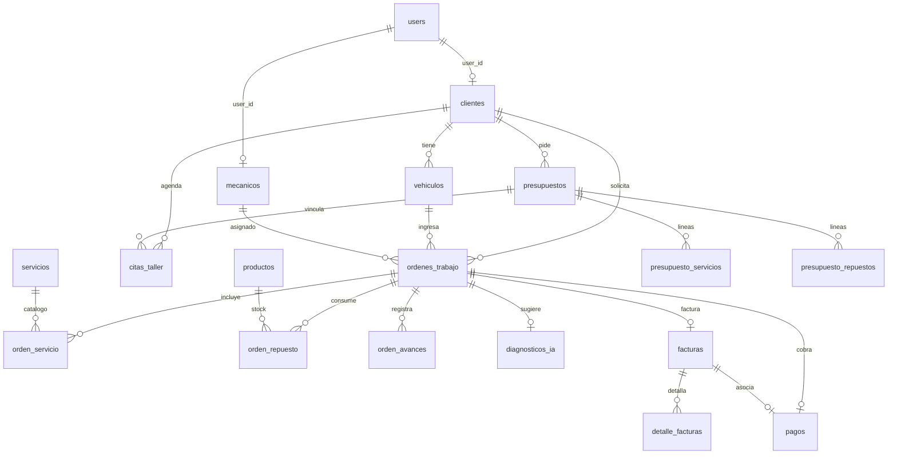

# Documentación de base de datos — AutoFix IA

Documento de referencia sobre **consultas a la base de datos**, **índices existentes y recomendados**, **triggers** y otros objetos de BD necesarios para el taller AutoFix IA.

> Motor esperado: **PostgreSQL** (uso de `ILIKE`, extensión `pgcrypto`, UUID con `gen_random_uuid()`).  
> Acceso: **Eloquent directo** desde controllers y services (no hay capa Repository en runtime).

---

## Tabla de contenidos

1. [Resumen del esquema](#1-resumen-del-esquema)
2. [Índices y restricciones actuales](#2-índices-y-restricciones-actuales)
3. [Consultas por módulo](#3-consultas-por-módulo)
4. [Transacciones atómicas](#4-transacciones-atómicas)
5. [¿Hace falta crear triggers?](#5-hace-falta-crear-triggers)
6. [Índices recomendados](#6-índices-recomendados)
7. [Otros objetos recomendados](#7-otros-objetos-recomendados)
8. [Matriz de prioridad](#8-matriz-de-prioridad)

---

## 1. Resumen del esquema

### Tablas de dominio (22)

| Tabla | Rol |
|-------|-----|
| `users` | Usuarios del sistema (admin, recepcionista, mecánico, cliente) |
| `clientes` | Ficha de cliente; opcionalmente ligada a `users` |
| `vehiculos` | Vehículos por cliente |
| `mecanicos` | Perfil de mecánico; opcionalmente ligado a `users` |
| `servicios` | Catálogo de servicios |
| `productos` | Inventario (repuestos y productos) |
| `ordenes_trabajo` | Órdenes de trabajo (OT) |
| `orden_servicio` | Líneas de servicio de una OT |
| `orden_repuesto` | Líneas de repuesto de una OT |
| `orden_avances` | Bitácora de avances de una OT |
| `diagnosticos_ia` | Sugerencia IA 1:1 con OT |
| `presupuestos` | Presupuestos del portal / taller |
| `presupuesto_servicios` | Líneas de servicio del presupuesto |
| `presupuesto_repuestos` | Líneas de repuesto del presupuesto |
| `citas_taller` | Agenda del taller |
| `facturas` | Facturas (1:1 con OT) |
| `detalle_facturas` | Detalle de factura |
| `pagos` | Pagos (1:1 con OT; opcional factura) |
| `notifications` | Notificaciones Laravel (UUID morph) |
| `personal_access_tokens` | Tokens Sanctum |
| `password_reset_tokens` | Reset de contraseña |
| `sessions` | Sesiones web |

### Tablas de infraestructura Laravel

`cache`, `cache_locks`, `jobs`, `job_batches`, `failed_jobs`.

### Notas estructurales

- **PKs**: UUID en todas las tablas de dominio.
- **Sin soft deletes** en ninguna tabla.
- **Sin triggers ni stored procedures** en el proyecto actual.
- Un único `DB::statement` en migraciones: `CREATE EXTENSION IF NOT EXISTS "pgcrypto"`.
- Inconsistencia conocida: algunos seeders antiguos referencian `categorias` / `categoria_id`; el esquema real usa `productos.categoria` (string).

---

## 2. Índices y restricciones actuales

### Únicos de negocio

| Tabla | Columna(s) |
|-------|------------|
| `users` | `email` |
| `clientes` | `numero_documento`, `email` |
| `vehiculos` | `placa` |
| `mecanicos` | `documento` |
| `servicios` | `nombre` |
| `productos` | `codigo` |
| `ordenes_trabajo` | `numero` |
| `diagnosticos_ia` | `orden_trabajo_id` (1:1) |
| `facturas` | `numero`, `orden_trabajo_id` (1:1) |
| `pagos` | `orden_trabajo_id`, `factura_id` |
| `presupuestos` | `numero` |
| `personal_access_tokens` | `token` |

### Índices no únicos explícitos

| Tabla | Índice | Uso |
|-------|--------|-----|
| `sessions` | `user_id`, `last_activity` | Sesiones |
| `personal_access_tokens` | `expires_at`, `[tokenable_type, tokenable_id]` | Sanctum |
| `notifications` | `[notifiable_type, notifiable_id]` | Inbox |
| `orden_avances` | `[orden_trabajo_id, created_at]` | Timeline OT |
| `presupuestos` | `[cliente_id, estado]` | Portal / listados |
| `citas_taller` | `[fecha_hora, estado]`, `mecanico_id`, `cliente_id` | Agenda y cupos |
| `jobs` | `queue` | Colas |

Las columnas `foreignUuid()->constrained()` también generan índice FK implícito en PostgreSQL/Laravel.

### Foreign keys relevantes (onDelete)

| Desde → Hacia | onDelete |
|---------------|----------|
| `vehiculos.cliente_id` → `clientes` | CASCADE |
| `ordenes_trabajo.cliente_id/vehiculo_id` → padres | CASCADE |
| `orden_servicio` / `orden_repuesto` / `orden_avances` / `diagnosticos_ia` → OT | CASCADE |
| `facturas` → OT / cliente | CASCADE |
| `detalle_facturas` → factura | CASCADE |
| `pagos` → OT | CASCADE; `factura_id` SET NULL |
| `presupuestos` → cliente CASCADE; vehículo SET NULL |
| `presupuesto_*` → presupuesto CASCADE; servicio/producto **RESTRICT** |
| `citas_taller` → cliente/vehículo CASCADE; mecánico/OT/presupuesto SET NULL |
| `clientes.user_id` / `mecanicos.user_id` → users | SET NULL |

**Sin FK declarada:** `sessions.user_id`, `detalle_facturas.referencia_id`, morphs de tokens/notificaciones.

---

## 3. Consultas por módulo

Para cada consulta se indica: **operación**, **tablas**, **filtros/joins**, **origen en código** y **notas de rendimiento**.

---

### 3.1 Auth / Usuarios

| # | Operación | Tablas | Filtros / detalle | Origen |
|---|-----------|--------|-------------------|--------|
| A1 | SELECT | `users` | `email = ?` | Login API/Web (`AuthController`, `WebAuthController`) |
| A2 | INSERT | `users` | Alta registro | Register / `UsuarioWebController::store` |
| A3 | INSERT | `personal_access_tokens` | Token Sanctum | Login/register API |
| A4 | DELETE | `personal_access_tokens` | Token actual | Logout API |
| A5 | SELECT paginado | `users` | `role`, `name/email ILIKE`, `ORDER BY name` | `UsuarioWebController::index` |
| A6 | SELECT + GROUP BY | `users` | `GROUP BY role` + COUNTs | Stats usuarios |
| A7 | UPDATE / DELETE | `users` | `id = ?` | Update / destroy usuarios |
| A8 | EXISTS | `users.email` | Validación `unique` | FormRequests |

**Índices:** `email` único cubre A1/A8. Para A5 conviene índice en `role` (ver §6).

---

### 3.2 ClienteCuentaService (puente user ↔ cliente)

| # | Operación | Tablas | Filtros | Origen |
|---|-----------|--------|---------|--------|
| C0a | SELECT | `clientes` | `user_id = ?` | `ensureForUser` |
| C0b | SELECT | `clientes` | `email = ? AND user_id IS NULL` | Vincular ficha huérfana |
| C0c | EXISTS loop | `clientes` | `numero_documento` | Generar documento único |
| C0d | INSERT / UPDATE | `clientes` | Crear o set `user_id` | Tras registro |

---

### 3.3 Clientes

| # | Operación | Tablas | Filtros / eager | Origen |
|---|-----------|--------|-----------------|--------|
| C1 | SELECT paginado | `clientes` + `vehiculos` | `with(vehiculos)`, `ORDER BY razon_social` | Web/API index |
| C2 | COUNT ×3 | `clientes` | Por `estado` | Stats |
| C3 | INSERT / UPDATE / SELECT | `clientes` | `id` | CRUD |
| C4 | EXISTS | `vehiculos` | `cliente_id = ?` | Bloqueo de delete si hay vehículos |
| C5 | EXISTS/UNIQUE | `numero_documento`, `email` | Validación | FormRequests |

---

### 3.4 Vehículos

| # | Operación | Tablas | Filtros | Origen |
|---|-----------|--------|---------|--------|
| V1 | SELECT | `vehiculos` + `clientes` | `with(cliente)`, `ORDER BY placa` | Index web/API |
| V2 | INSERT / UPDATE / DELETE | `vehiculos` | `id` | CRUD |
| V3 | SELECT options | `clientes` | `estado = true`, `ORDER BY razon_social` | Formularios |
| V4 | UNIQUE | `placa` | Validación | FormRequests |
| V5 | SELECT | `vehiculos` | `cliente_id IN (...)` | Portal cliente |

---

### 3.5 Mecánicos

| # | Operación | Tablas | Filtros | Origen |
|---|-----------|--------|---------|--------|
| M1 | SELECT | `mecanicos` | `ORDER BY nombres` | Index |
| M2 | CRUD | `mecanicos` | `id` | Web/API |
| M3 | SELECT | `mecanicos.user_id` NOT NULL + `users` | `role = mecanico`, `activo`, `id NOT IN (...)` | Options de usuario libre |
| M4 | SELECT | `mecanicos` | `activo`, `especialidad LIKE`, limit 3 | `GroqDiagnosticService::sugerirMecanicos` |

---

### 3.6 Servicios

| # | Operación | Tablas | Filtros | Origen |
|---|-----------|--------|---------|--------|
| S1 | SELECT paginado | `servicios` | `ORDER BY` CASE (diagnóstico primero) + `nombre` | Web index |
| S2 | SELECT | `servicios` | `activo = true` | Options OT / presupuesto / IA |
| S3 | CRUD + UNIQUE nombre | `servicios` | — | Web/API |

---

### 3.7 Productos / Inventario

| # | Operación | Tablas | Filtros | Origen |
|---|-----------|--------|---------|--------|
| P1 | SELECT paginado | `productos` | `tipo_producto = 'repuesto'`; ILIKE codigo/nombre/proveedor; `categoria`; `stock <= stock_minimo`; `activo`; `ORDER BY categoria, nombre` | Inventario web |
| P2 | DISTINCT | `productos.categoria` | `tipo_producto = repuesto` | Categorías sugeridas |
| P3 | INSERT / UPDATE | `productos` | Alta / edición / `ajustarStock` | Web |
| P4 | EXISTS + UPDATE/DELETE | `orden_repuesto` | Si el producto está usado → `activo = false`; si no → DELETE | Destroy |
| P5 | SELECT + FOR UPDATE | `productos` | `id` + `lockForUpdate()` | `OrdenRepuestoStockService` |
| P6 | INCREMENT / DECREMENT | `productos.stock` | Por línea de OT | Stock service |
| P7 | Agregados | `productos` | Conteos stock bajo / sin stock / `SUM(precio * stock)` | Reportes |

**Nota crítica:** P5 usa `SELECT … FOR UPDATE` dentro de transacciones de OT; es el único locking pesimista del sistema.

---

### 3.8 Órdenes de trabajo

| # | Operación | Tablas | Filtros / eager | Origen |
|---|-----------|--------|-----------------|--------|
| O1 | SELECT paginado | `ordenes_trabajo` + relaciones | `with(cliente, vehiculo, mecanico, factura, servicios, repuestos, creator, updater)`; mecánico filtra `mecanico_id`; `ORDER BY created_at DESC` | Index web |
| O2 | SELECT options | clientes/vehículos/mecánicos/servicios/productos | Varios `activo`/`estado` | Create form |
| O3 | SELECT LIKE | `ordenes_trabajo.numero` | `numero LIKE 'OT-{fecha}-%'` `ORDER BY numero DESC LIMIT 1` | `generarNumero()` |
| O4 | INSERT | `ordenes_trabajo` (+ opcional `citas_taller`) | Tx | Store |
| O5 | DELETE + INSERT | `orden_servicio` | Reemplazo de líneas | Update |
| O6 | Stock sync | `productos` + `orden_repuesto` | via `OrdenRepuestoStockService` | Store/update/destroy |
| O7 | INSERT | `orden_avances` + UPDATE `updated_by` | Bitácora | `storeAvance` |
| O8 | UPDATE | `ordenes_trabajo` + `citas_taller.mecanico_id` | Asignar mecánico | `asignarMecanico` |
| O9 | UPDATE estado | `ordenes_trabajo` | + notificación (load cliente.user) | `cambiarEstado` |
| O10 | DELETE OT | `ordenes_trabajo` | Restaura stock antes; CASCADE borra hijos | Destroy (tx) |

---

### 3.9 Diagnóstico IA

| # | Operación | Tablas | Filtros | Origen |
|---|-----------|--------|---------|--------|
| D1 | SELECT | `diagnosticos_ia` + OT | Mecánico: `whereHas` OT.`mecanico_id` | Index |
| D2 | SELECT | `ordenes_trabajo` | `whereDoesntHave('sugerenciaIa')` AND estado pendiente/en_diagnostico | Create form |
| D3 | SELECT catálogos | `servicios`, `productos` | activos; limits 80/120 | Store (prompt IA) |
| D4 | INSERT | `diagnosticos_ia` | 1:1 OT | Store (tx) |
| D5 | UPDATE OT + líneas | OT, cita, `orden_servicio`, stock | `AplicarSugerenciaIaAOrdenService` | Store |
| D6 | UPDATE | `diagnosticos_ia` (+ OT estado) | Revisar / confirmar / descartar | `revisar` |

---

### 3.10 Citas / Calendario

| # | Operación | Tablas | Filtros | Origen |
|---|-----------|--------|---------|--------|
| T1 | SELECT | `citas_taller` + relaciones | `fecha_hora BETWEEN`; filtros por rol (`mecanico_id` / `cliente_id IN`) | Calendario index |
| T2 | SELECT | `citas_taller` | `DATE(fecha_hora) = ?` AND `estado IN (programada, reagendada)` | `DisponibilidadCitasService` |
| T3 | INSERT | `citas_taller` | Staff o portal | store / agendar |
| T4 | Tx portal | `presupuestos` + líneas + `citas_taller` | Vincular presupuesto, crear cita | `agendar` |
| T5 | Tx crear OT | OT + líneas desde presupuesto + UPDATE cita | Copia servicios/repuestos | `crearOt` |
| T6 | UPDATE | `citas_taller` | cancelar / reagendar / completar | Estados |
| T7 | SELECT | `users` | `activo` AND `role IN (admin, recepcionista)` | `CitaNotifier` |
| T8 | SELECT | `clientes.id` | `user_id = ?` | Scope portal |

**Índice actual `[fecha_hora, estado]`** cubre parcialmente T1/T2; `whereDate` puede no usar el índice de forma óptima (ver §6).

---

### 3.11 Presupuestos

| # | Operación | Tablas | Filtros | Origen |
|---|-----------|--------|---------|--------|
| PR1 | SELECT | `presupuestos` + cliente/vehículo | `estado`; ILIKE numero/cliente/placa | Taller index |
| PR2 | SELECT | `presupuestos` | `cliente_id` | Portal index |
| PR3 | SELECT LIKE | `numero LIKE 'PRE-{fecha}-%'` | Numeración | `generarNumero` |
| PR4 | INSERT + sync | presupuesto + líneas | Tx | store |
| PR5 | DELETE + INSERT líneas | `presupuesto_servicios` / `_repuestos` | `PresupuestoLineasService::syncLineas` | store/update |
| PR6 | SELECT | servicios/productos activos | Validar stock > 0 en repuestos | sync |
| PR7 | UPDATE | `estado = cancelado` / `vinculado` | cancelar / agendar cita | — |

---

### 3.12 Facturas

| # | Operación | Tablas | Filtros | Origen |
|---|-----------|--------|---------|--------|
| F1 | SELECT | `facturas` + cliente, OT | `ORDER BY created_at DESC` | Index |
| F2 | SELECT | `ordenes_trabajo` | `whereDoesntHave('factura')` | Create form |
| F3 | SELECT LIKE | `numero LIKE 'F-{fecha}-%'` | Numeración | `generarNumero` |
| F4 | INSERT tx | `facturas` + `detalle_facturas` (+ opcional UPDATE cliente snapshot) | store | Web/API |
| F5 | UPDATE | `facturas` | Recalc si cambia descuento | update |
| F6 | DELETE | `facturas` | Bloquea si existe pago | destroy |
| F7 | loadMissing | líneas OT | Cálculo de montos | `calcularDesdeOrden` |

---

### 3.13 Pagos

| # | Operación | Tablas | Filtros | Origen |
|---|-----------|--------|---------|--------|
| PG1 | SELECT | `pagos` + OT.cliente/vehículo | `ORDER BY created_at DESC` | Index |
| PG2 | SELECT | OTs sin pago | `whereDoesntHave('pago')` | Create |
| PG3 | INSERT | `pagos` | + sync montos/estado factura | store |
| PG4 | UPDATE | `pagos` + `facturas` | Sync descuento/subtotal/iva/total/estado | update |
| PG5 | DELETE | `pagos` | **No revierte** montos de factura | destroy |

**Observación:** PG3/PG4 no usan `DB::transaction` explícita; hay riesgo de inconsistencia parcial (ver §7).

---

### 3.14 Dashboard

| # | Operación | Tablas | Filtros | Origen |
|---|-----------|--------|---------|--------|
| DA1 | COUNT | `ordenes_trabajo` | `estado NOT IN (finalizada, entregada, cancelada)`; opcional `mecanico_id` | Métricas |
| DA2 | COUNT | `facturas` | `estado IN (borrador, emitida)` | Admin/recep |
| DA3 | SUM | `pagos.total` | `estado = pagado` + mes/año `created_at` | Ingresos mes |
| DA4 | COUNT | `clientes` | `estado = true` | Clientes activos |
| DA5 | SELECT LIMIT 5 | `ordenes_trabajo` + cliente/vehículo | `ORDER BY created_at DESC` | Recientes |
| DA6 | SELECT | `mecanicos` | `user_id = ?` (lazy) | Scope mecánico |

---

### 3.15 Reportes (`ReporteDatosService`)

| # | Operación | Tablas | Detalle |
|---|-----------|--------|---------|
| R1 | GROUP BY | `ordenes_trabajo` | Órdenes por `estado` |
| R2 | GROUP BY DATE | `pagos` | `estado = pagado`, últimos 30 días de fechas |
| R3 | JOIN + GROUP | `orden_servicio` ⋈ `servicios` | Top 10 servicios |
| R4 | JOIN + GROUP | `orden_repuesto` ⋈ `productos` | Top 10 repuestos |
| R5 | JOIN + GROUP | `ordenes_trabajo` ⋈ `clientes` | Top clientes por órdenes |
| R6 | GROUP BY | `diagnosticos_ia.estado` | IA por estado |
| R7 | COUNT | `diagnosticos_ia` | Simulados vs reales |
| R8 | Agregados | `productos` tipo repuesto | Inventario / stock bajo |
| R9 | COUNT / SUM | OT total; pagos pagados | Totales globales |

---

### 3.16 Portal cliente / Historial

| # | Operación | Tablas | Filtros | Origen |
|---|-----------|--------|---------|--------|
| PO1 | SELECT | `vehiculos` | `cliente_id` | Mis vehículos |
| PO2 | INSERT | `vehiculos` | Portal | Guardar vehículo |
| PO3 | SELECT | `ordenes_trabajo` + vehiculo/pago/factura/IA | `cliente_id IN (...)` | Mis órdenes |
| PO4 | SELECT | OT detalle + avances + IA + factura + pago | Scope cliente | Mostrar OT |
| PO5 | SELECT | `facturas` | cliente + estado emitida/pagada | Mostrar factura |
| PO6 | SELECT | `notifications` | notifiable user, `ORDER BY created_at LIMIT 8` | Inbox |
| PO7 | UPDATE tx | `clientes` + `users` | Perfil portal | `actualizarDatos` |
| H1 | SELECT | `vehiculos` + cliente + `withCount(ordenesTrabajo)` | LIKE placa/marca/modelo/cliente | Historial taller |
| H2 | SELECT | `ordenes_trabajo` | `vehiculo_id` + mecanico/pago/factura | Detalle historial |

---

### 3.17 Notificaciones

Las clases `app/Notifications/*` no consultan BD por sí solas. El flujo real es:

1. Services cargan relaciones (`loadMissing`).
2. `$user->notify(...)` → **INSERT** en `notifications`.
3. Portal lee las últimas 8 con SELECT por morph + `created_at`.

---

### 3.18 Validaciones implícitas (FormRequests)

Reglas `exists:` / `unique:` generan `SELECT`/`EXISTS` frecuentes sobre:

`users`, `clientes`, `vehiculos`, `mecanicos`, `servicios`, `productos`, `ordenes_trabajo`, `presupuestos`, `facturas`, `pagos`, `citas_taller`.

Estas consultas son cortas y están cubiertas por PKs/únicos existentes.

---

## 4. Transacciones atómicas

| Ubicación | Operaciones protegidas |
|-----------|------------------------|
| `OrdenTrabajoWeb/API` store / update / destroy | OT ± cita; sync líneas + stock; restaurar stock + delete |
| `CalendarioWebController` agendar / crearOt | Presupuesto + cita; OT + líneas + link cita |
| `PortalPresupuesto` store / update | Presupuesto + líneas |
| `PresupuestoLineasService::syncLineas` | Delete/insert líneas + totales |
| `DiagnosticoIaWebController::store` | Diagnóstico + OT + aplicación IA (líneas/stock) |
| `FacturaWeb/API::store` | Factura + detalles (+ snapshot cliente) |
| `PortalCliente::actualizarDatos` | Cliente + user |

**Sin transacción explícita (riesgo):** registro de pagos + sync de factura (`PagoWebController` / `PagoController`).

---

## 5. ¿Hace falta crear triggers?

### Veredicto general

**No es obligatorio crear triggers** para que el sistema funcione: la lógica de negocio ya está en PHP (Eloquent + services).  
Sí hay **casos donde un trigger o un mecanismo equivalente en BD** aportaría integridad ante condiciones de carrera o bypass de la aplicación.

### Análisis caso por caso

| Necesidad | ¿Trigger? | Recomendación |
|-----------|-----------|---------------|
| Descontar / devolver stock al insertar/borrar `orden_repuesto` | Opcional | **No prioritario.** Ya se maneja en `OrdenRepuestoStockService` con `lockForUpdate`. Un trigger duplicaría lógica y dificultaría restores. Preferir mantenerlo en aplicación. |
| Impedir stock negativo | **Sí (CHECK o trigger)** | Añadir `CHECK (stock >= 0)` en `productos`. Es más simple y efectivo que un trigger. El lock actual no protege updates fuera de la app. |
| Numeración OT / Factura / Presupuesto (`generarNumero`) | Alternativa mejor: **secuencia** | Hoy: `SELECT … LIKE prefijo ORDER BY DESC` + unique. Bajo concurrencia puede chocar (unique violation). Preferible secuencia por día o tabla contador con `UPDATE … RETURNING`, no un trigger clásico. |
| Sync estado factura ↔ pago | Opcional | Mejor envolver en `DB::transaction` en PHP. Un trigger AFTER INSERT/UPDATE en `pagos` sincronizando `facturas` acoplaría demasiado. |
| Impedir 2.ª factura/pago/diagnóstico por OT | Ya cubierto | Uniques `orden_trabajo_id` en `facturas`, `pagos`, `diagnosticos_ia`. **No hace falta trigger.** |
| Actualizar `updated_by` / bitácora | No | Se hace en controllers. |
| CASCADE de borrados | Ya en FK | CASCADE / SET NULL / RESTRICT cubren integridad referencial. **No hace falta trigger.** |
| Auditoría (quién cambió qué) | Opcional futuro | Solo si se exige historial inmutable. Hoy no hay requisito; `orden_avances` y `updated_by` bastan para operación. |
| Notificaciones | No | Laravel notifications; no pertenece a BD. |
| Capacidad de cupos de cita | Opcional | Hoy se valida en `DisponibilidadCitasService`. Un exclusion constraint o trigger de conteo por slot sería defensa extra ante doble booking concurrente. |

### Triggers / constraints concretos sugeridos (solo si se endurece integridad)

```sql
-- 1) Stock nunca negativo (recomendado)
ALTER TABLE productos
  ADD CONSTRAINT productos_stock_non_negative CHECK (stock >= 0);

-- 2) (Opcional) Evitar solapamiento extremo de citas del mismo mecánico
-- Preferible exclusion constraint con tstzrange si se modela intervalo:
-- ALTER TABLE citas_taller ADD EXCLUDE USING gist (...);
-- Requiere diseño adicional; no es trivial con el modelo actual de cupos globales por slot.
```

**Conclusión triggers:** no crear triggers de negocio ahora. Sí añadir **CHECK de stock** y endurecer **numeración** y **transacciones de pago** en aplicación/BD sin triggers.

---

## 6. Índices recomendados

### Alta prioridad (consultas frecuentes / filtros calientes)

| Índice propuesto | Justifica consulta(s) |
|------------------|----------------------|
| `ordenes_trabajo (estado)` | Dashboard DA1, reportes R1, listados filtrados |
| `ordenes_trabajo (mecanico_id, estado)` | Dashboard y listado del mecánico |
| `ordenes_trabajo (created_at DESC)` | Listados O1, DA5 |
| `ordenes_trabajo (cliente_id, created_at DESC)` | Portal PO3, historial por cliente |
| `ordenes_trabajo (vehiculo_id)` | Historial H2 (si el FK no basta en planificador) |
| `productos (tipo_producto, activo)` | Inventario P1, options, reportes R8 |
| `productos (tipo_producto, activo, stock)` | Stock bajo / sin stock |
| `facturas (estado)` | Dashboard DA2 |
| `pagos (estado, created_at)` | Dashboard DA3, reportes R2 / R9 |
| `users (role, activo)` | Notifier T7, options mecánicos M3, listado A5 |
| `clientes (user_id)` | Scope portal T8 / PO* (si no está por FK) |
| `clientes (estado)` | DA4, options |
| `diagnosticos_ia (estado)` | Reportes R6 |
| `mecanicos (activo, especialidad)` | Matching IA M4 |

### Media prioridad

| Índice propuesto | Justifica |
|------------------|-----------|
| `productos (categoria)` parcial donde tipo=repuesto | Filtro inventario |
| `servicios (activo)` | Options OT/presupuesto |
| `vehiculos (cliente_id, activo)` | Options y portal |
| `citas_taller (fecha_hora)` o expresión `DATE(fecha_hora)` | `whereDate` en disponibilidad T2; el índice compuesto actual `[fecha_hora, estado]` ayuda, pero un índice por fecha puede mejorar planes |
| `notifications (notifiable_type, notifiable_id, created_at DESC)` | Inbox portal PO6 |
| Prefijo funcional / trigram (`pg_trgm`) en `placa`, `razon_social`, `numero` | Búsquedas `ILIKE '%…%'` de presupuestos/historial |

### Baja prioridad / no necesarios aún

- Índices en columnas ya unique (`placa`, `codigo`, `numero`, etc.).
- Índices en tablas pequeñas de catálogo si el volumen es bajo.
- Índices en `detalle_facturas.referencia_id` (no se usa en JOINs de reporte).

### Ejemplo de migración sugerida

```php
Schema::table('ordenes_trabajo', function (Blueprint $table) {
    $table->index('estado');
    $table->index(['mecanico_id', 'estado']);
    $table->index('created_at');
    $table->index(['cliente_id', 'created_at']);
});

Schema::table('productos', function (Blueprint $table) {
    $table->index(['tipo_producto', 'activo']);
});

Schema::table('pagos', function (Blueprint $table) {
    $table->index(['estado', 'created_at']);
});

Schema::table('facturas', function (Blueprint $table) {
    $table->index('estado');
});

Schema::table('users', function (Blueprint $table) {
    $table->index(['role', 'activo']);
});
```

---

## 7. Otros objetos recomendados

### 7.1 Constraints CHECK

| Constraint | Tabla | Motivo |
|------------|-------|--------|
| `stock >= 0` | `productos` | Evitar inventario negativo aunque falle la app |
| `cantidad > 0` | `orden_repuesto`, `presupuesto_repuestos` | Datos incoherentes |
| `total >= 0` | `pagos`, `facturas`, `presupuestos` | Integridad monetaria |
| Enums vía CHECK (opcional) | `estado` en OT/citas/facturas/pagos | Si no se confía solo en PHP enums |

### 7.2 Numeración concurrente

Reemplazar el patrón `LIKE + MAX` por una de estas opciones:

1. **Tabla `document_sequences`** (`tipo`, `periodo`, `ultimo`) con `UPDATE … RETURNING` bajo lock.
2. **Secuencias PostgreSQL** por tipo/día (más complejo de rotar diariamente).
3. Mantener el patrón actual y **reintentar** ante `UniqueConstraintViolation` (mínimo viable).

Afecta: `OrdenTrabajoEloquentModel::generarNumero`, `FacturaEloquentModel::generarNumero`, `PresupuestoEloquentModel::generarNumero`.

### 7.3 Transacciones faltantes

Envolver en `DB::transaction`:

- `PagoWebController::store` / `::update` (pago + sync factura).
- Idealmente `PagoController` API equivalente.

### 7.4 Foreign keys faltantes / inconsistencias

| Ítem | Acción sugerida |
|------|-----------------|
| `sessions.user_id` | FK a `users` ON DELETE CASCADE (opcional) |
| `detalle_facturas.referencia_id` | FK polimórfica lógica; documentar que apunta a servicio/producto sin constraint |
| Seeders `categorias` | Alinear o eliminar; el esquema usa `productos.categoria` string |

### 7.5 Vistas materializadas (futuro, solo con volumen alto)

Para `ReporteDatosService` (R1–R9), si los reportes se vuelven lentos:

- Vista materializada de ingresos diarios (`pagos` pagados agrupados por fecha).
- Vista de top servicios/repuestos.

No son necesarias en la etapa actual del taller.

### 7.6 Extensiones PostgreSQL

| Extensión | Estado | Uso |
|-----------|--------|-----|
| `pgcrypto` | Ya creada en migración Sanctum | UUID |
| `pg_trgm` | No | Acelerar `ILIKE '%texto%'` en búsquedas |
| `btree_gist` | No | Solo si se adoptan exclusion constraints de agenda |

---

## 8. Matriz de prioridad

| Acción | Tipo | Prioridad | Esfuerzo |
|--------|------|-----------|----------|
| Índices en `ordenes_trabajo` (estado, mecanico+estado, created_at, cliente+created_at) | INDEX | Alta | Bajo |
| Índices en `productos (tipo_producto, activo)` y `pagos (estado, created_at)` | INDEX | Alta | Bajo |
| `CHECK (stock >= 0)` en `productos` | CONSTRAINT | Alta | Bajo |
| `DB::transaction` en flujo de pagos | APP | Alta | Bajo |
| Reintentos o secuencia para `generarNumero` | APP / SEQ | Media | Medio |
| Índice `users (role, activo)` + `clientes (estado)` | INDEX | Media | Bajo |
| Índice compuesto notificaciones + `created_at` | INDEX | Media | Bajo |
| `pg_trgm` para búsquedas ILIKE | EXT + INDEX | Baja–Media | Medio |
| Triggers de stock / sync factura | TRIGGER | **No recomendado** | — |
| Exclusion constraint de citas | CONSTRAINT | Baja (solo si hay doble booking real) | Alto |
| Vistas materializadas de reportes | VIEW | Baja | Medio |

---

## Anexo A — Diagrama de dependencias (dominio)



---

## Anexo B — Mapa rápido “consulta → índice”

| Patrón de consulta | Índice que lo sirve |
|--------------------|---------------------|
| Login por email | `users.email` UNIQUE (existe) |
| OT abiertas / por estado | `ordenes_trabajo(estado)` (recomendado) |
| OT del mecánico | `(mecanico_id, estado)` (recomendado) |
| Portal: mis OT | `(cliente_id, created_at)` (recomendado) |
| Inventario repuestos | `(tipo_producto, activo)` (recomendado) |
| Ingresos mes / por fecha | `(estado, created_at)` en `pagos` (recomendado) |
| Agenda por rango | `[fecha_hora, estado]` (existe) |
| Cupos del día | Mejorar con índice por fecha (recomendado) |
| Stock con lock | PK `productos.id` + CHECK stock (recomendado) |
| Numeración documentos | UNIQUE `numero` (existe) + estrategia de secuencia (recomendado) |
| 1 factura / 1 pago / 1 IA por OT | UNIQUE `orden_trabajo_id` (existe) |

---

*Generado a partir del código y migraciones del repositorio AutoFix-IA. Refleja el estado del esquema y de las consultas Eloquent en controllers/services al momento de la documentación.*
