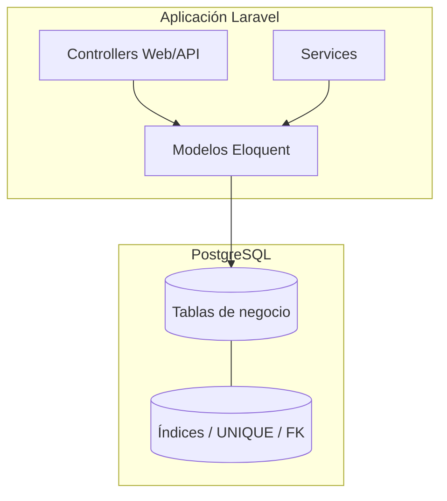
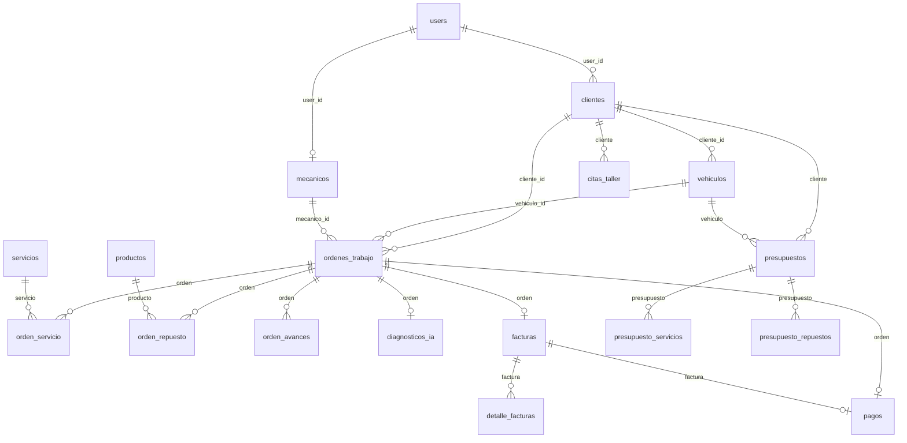

# Documentación de consultas a la base de datos — AutoFix

Documento de referencia sobre el acceso a PostgreSQL en el proyecto AutoFix (taller mecánico). Describe el esquema, cada consulta relevante por bounded context, y recomendaciones de **índices**, **triggers**, **constraints**, **secuencias** y otros objetos de base de datos.

> Motor por defecto: **PostgreSQL** (`DB_CONNECTION=pgsql`).  
> Acceso: **Eloquent / Query Builder** desde controladores y servicios (no hay capa `Repositories` activa en la mayoría de módulos).

---

## Tabla de contenidos

1. [Resumen arquitectónico](#1-resumen-arquitectónico)
2. [Esquema de tablas](#2-esquema-de-tablas)
3. [Consultas por bounded context](#3-consultas-por-bounded-context)
4. [Consultas transversales (dashboard, reportes, portal)](#4-consultas-transversales-dashboard-reportes-portal)
5. [Transacciones, locks y concurrencia](#5-transacciones-locks-y-concurrencia)
6. [Índices existentes](#6-índices-existentes)
7. [Recomendaciones de índices](#7-recomendaciones-de-índices)
8. [¿Hace falta crear triggers?](#8-hace-falta-crear-triggers)
9. [Secuencias, constraints y otros objetos](#9-secuencias-constraints-y-otros-objetos)
10. [Priorización de trabajo en BD](#10-priorización-de-trabajo-en-bd)

---

## 1. Resumen arquitectónico

| Aspecto | Estado actual |
|--------|----------------|
| Soft deletes | No se usan (`deleted_at` ausente) |
| Repositorios | No hay implementaciones activas; queries en controllers/services |
| `lockForUpdate` | Solo en `OrdenRepuestoStockService` (stock de productos) |
| `DB::transaction` | Órdenes, facturas, diagnósticos IA, citas, presupuestos, portal cliente |
| Agregaciones pesadas | Concentradas en `ReporteDatosService` |
| Cola / caché / sesión | Drivers `database` → tablas `jobs`, `cache`, `sessions` |
| Notificaciones | Canal `database` en citas, facturas y revisión de órdenes |



---

## 2. Esquema de tablas

### 2.1 Infraestructura Laravel

| Tabla | Uso |
|-------|-----|
| `cache` / `cache_locks` | Caché con driver database |
| `jobs` / `job_batches` / `failed_jobs` | Cola con driver database |
| `sessions` | Sesiones web |
| `notifications` | Notificaciones in-app (UUID + morph `notifiable`) |
| `password_reset_tokens` | Reset de contraseña |
| `personal_access_tokens` | Sanctum (API) |

### 2.2 Dominio de negocio

| Tabla | Clave de negocio | FKs principales |
|-------|------------------|-----------------|
| `users` | `email` UNIQUE | — |
| `clientes` | `numero_documento`, `email` UNIQUE | `user_id` → users |
| `vehiculos` | `placa` UNIQUE | `cliente_id` → clientes |
| `mecanicos` | `documento` UNIQUE | `user_id` → users |
| `servicios` | `nombre` UNIQUE | — |
| `productos` | `codigo` UNIQUE | — |
| `ordenes_trabajo` | `numero` UNIQUE | cliente, vehículo, mecánico, created_by/updated_by |
| `orden_servicio` | — | orden + servicio |
| `orden_repuesto` | — | orden + producto |
| `orden_avances` | — | orden + user |
| `citas_taller` | — | cliente, vehículo, mecánico, OT, presupuesto |
| `presupuestos` | `numero` UNIQUE | cliente, vehículo |
| `presupuesto_servicios` / `presupuesto_repuestos` | — | presupuesto + servicio/producto |
| `diagnosticos_ia` | `orden_trabajo_id` UNIQUE | orden |
| `facturas` | `numero` UNIQUE, `orden_trabajo_id` UNIQUE | orden, cliente, usuario |
| `detalle_facturas` | — | factura |
| `pagos` | `orden_trabajo_id` UNIQUE, `factura_id` UNIQUE | orden, factura, usuario |

> **Nota PostgreSQL:** las FKs declaradas con `foreignUuid()` **no crean índice automático** (a diferencia de MySQL InnoDB). Varias FKs calientes hoy carecen de índice explícito.

---

## 3. Consultas por bounded context

Leyenda de tipo: **R** lectura · **W** escritura · **U** update · **D** delete · **A** agregación · **TX** transacción · **L** lock

### 3.1 Auth / Usuarios

| Origen | Tipo | Consulta / comportamiento | Tablas |
|--------|------|---------------------------|--------|
| `AuthController::register` | W | `INSERT` usuario; `createToken` | `users`, `personal_access_tokens` |
| `AuthController::login` | R+W | `WHERE email`; crea token Sanctum | `users`, tokens |
| `AuthController::logout` | D | elimina token actual | `personal_access_tokens` |
| `WebAuthController::login` | R | `Auth::attempt(email, password)` | `users` |
| `WebAuthController::register` | W | crea user + cliente vía service | `users`, `clientes` |
| `UsuarioWebController::index` | R+A | listado `ORDER BY name`; filtros `role`, `ILIKE` name/email; `GROUP BY role` + `COUNT` | `users` |
| `UsuarioWebController` CRUD | W/U/D | alta / edición / baja de usuarios | `users` |
| `ClienteCuentaService::ensureForUser` | R+W/U | busca por `user_id` o `email` sin user; valida `numero_documento`; crea/vincula | `clientes` |
| `CitaNotifier::notifyTaller` | R+W | usuarios `activo` + `role IN (admin, recepcionista)`; inserta notificaciones | `users`, `notifications` |

**Filtros frecuentes:** `email`, `role`, `activo`, `name`/`email` con `ILIKE`.

---

### 3.2 Cliente

| Origen | Tipo | Consulta / comportamiento | Tablas |
|--------|------|---------------------------|--------|
| `ClienteWebController::index` | R+A | `with(vehiculos ORDER BY placa)`, `ORDER BY razon_social`, paginate; counts por `estado` | `clientes`, `vehiculos` |
| CRUD Web/API | W/U/D | create/update/delete; destroy comprueba `vehiculos()->exists()` | `clientes`, `vehiculos` |
| `PortalClienteWebController::actualizarDatos` | U+TX | actualiza cliente + user en transacción | `clientes`, `users` |
| Seeders | W | `updateOrCreate` por documento/email | `clientes` |

---

### 3.3 Vehículo

| Origen | Tipo | Consulta / comportamiento | Tablas |
|--------|------|---------------------------|--------|
| `VehiculoWebController::index` | R | `with('cliente')`, `ORDER BY placa`, paginate | `vehiculos`, `clientes` |
| CRUD Web/API | W/U/D | alta / edición / baja | `vehiculos` |
| Options (OT, Cita, etc.) | R | clientes `estado=true`; vehículos `activo=true` | `clientes`, `vehiculos` |
| Portal `misVehiculos` / `guardarVehiculo` | R/W | `WHERE cliente_id`, `ORDER BY placa`; insert | `vehiculos` |
| `HistorialWebController::index` | R+A | `with('cliente')`, **`withCount('ordenesTrabajo')`**, búsqueda `LOWER(placa/marca/modelo)`, `orWhereHas` cliente | `vehiculos`, `ordenes_trabajo`, `clientes` |
| `HistorialWebController::show` | R | vehículo + OTs `WHERE vehiculo_id ORDER BY created_at DESC` | `vehiculos`, `ordenes_trabajo` |

---

### 3.4 Mecánico

| Origen | Tipo | Consulta / comportamiento | Tablas |
|--------|------|---------------------------|--------|
| `MecanicoWebController::index` | R | `ORDER BY nombres`, paginate | `mecanicos` |
| CRUD | W/U/D | alta / edición / baja | `mecanicos` |
| `usuariosMecanicoOptions` | R | mecánicos con `user_id`; users `role=mecanico` activos no enlazados | `mecanicos`, `users` |
| `GroqDiagnosticService::sugerirMecanicos` | R | `activo`; `LOWER(especialidad) LIKE …`; fallback mantenimiento | `mecanicos` |
| Options OT/Cita/Dashboard | R | `WHERE activo ORDER BY nombres` | `mecanicos` |

---

### 3.5 Servicio

| Origen | Tipo | Consulta / comportamiento | Tablas |
|--------|------|---------------------------|--------|
| `ServicioWebController::index` | R | `ORDER BY` CASE (prioriza diagnóstico computarizado) + nombre | `servicios` |
| CRUD | W/U/D | catálogo | `servicios` |
| Catálogos (OT, IA, Presupuesto, Cita) | R | `WHERE activo ORDER BY nombre` | `servicios` |
| `AplicarSugerenciaIaAOrdenService` | R | búsqueda `LIKE` / carga activos para matching fuzzy | `servicios` |

---

### 3.6 Producto (inventario / repuestos)

| Origen | Tipo | Consulta / comportamiento | Tablas |
|--------|------|---------------------------|--------|
| `ProductoWebController::index` | R | `tipo_producto=repuesto`; `ILIKE` código/nombre/proveedor; filtro categoría; `stock <= stock_minimo`; `activo`; `ORDER BY categoria, nombre` | `productos` |
| `ajustarStock` | U | actualiza `stock` | `productos` |
| `destroy` | R+U/D | `EXISTS` en `orden_repuesto` → desactiva o elimina | `productos`, `orden_repuesto` |
| `OrdenRepuestoStockService` | R+L+U+W | **`SELECT … FOR UPDATE`**, `decrement`/`increment` stock; insert/delete líneas | `productos`, `orden_repuesto` |
| `ValidatesRepuestoStock` | R+A | producto + `SUM(cantidad)` por orden+producto | `productos`, `orden_repuesto` |
| Reportes inventario | R+A | counts, stock bajo, `SUM(precio * stock)` | `productos` |

---

### 3.7 Orden de trabajo

| Origen | Tipo | Consulta / comportamiento | Tablas |
|--------|------|---------------------------|--------|
| `OrdenTrabajoWebController::index` | R | eager cliente/vehículo/mecánico/factura/pago/sugerenciaIa/cita; `ORDER BY created_at DESC`; filtro `mecanico_id` si rol mecánico | `ordenes_trabajo` (+ relacionados) |
| `store` | W+TX | genera número (`LIKE OT-{fecha}-%`); crea OT; opcional cita | `ordenes_trabajo`, `citas_taller` |
| `edit` / `show` | R | carga amplia (servicios, repuestos, avances, IA…) | varias |
| `storeAvance` | W+U | inserta `orden_avances`; actualiza `updated_by` | `orden_avances`, `ordenes_trabajo` |
| `update` | U+TX | sync servicios (delete+create); stock vía service; sync `cita.mecanico_id` | OT, líneas, citas, productos |
| `destroy` | D+TX | restaura stock + delete OT (cascade líneas) | OT, productos |
| `asignarMecanico` / `cambiarEstado` | U | update + notificaciones | `ordenes_trabajo` |
| API `OrdenTrabajoController` | similar | mismo patrón sin flujo web de citas/avances | — |
| `CalendarioWebController::crearOt` | W+TX | OT + líneas desde presupuesto (**sin** `lockForUpdate` / decrement stock) | OT, líneas |
| `OrdenTrabajoEloquentModel::generarNumero` | R | `WHERE numero LIKE 'OT-YYYYMMDD-%' ORDER BY numero DESC` | `ordenes_trabajo` |

---

### 3.8 Cita / Calendario

| Origen | Tipo | Consulta / comportamiento | Tablas |
|--------|------|---------------------------|--------|
| `CalendarioWebController::index` | R | `with` relaciones; **`WHERE fecha_hora BETWEEN`**; filtros mecánico/cliente; OTs del día `whereDate(created_at)` | `citas_taller`, `ordenes_trabajo` |
| `store` (taller) | W | crea cita | `citas_taller` |
| `agendar` (cliente) | R+U+W+TX | cliente por `user_id`; presupuesto; marca presupuesto `VinculadoCita`; crea cita | `clientes`, `presupuestos`, `citas_taller` |
| `cancelar` / `reagendar` / `completar` | U | estado / `fecha_hora` | `citas_taller` |
| `DisponibilidadCitasService::slotsParaFecha` | R | **`whereDate(fecha_hora)`** + `estado IN (programada, reagendada)` | `citas_taller` |
| Presupuestos disponibles para cita | R | `cliente_id` + estado + `valido_hasta` null o ≥ hoy | `presupuestos` |

> El índice compuesto `(fecha_hora, estado)` ya cubre bien calendario y disponibilidad.

---

### 3.9 Presupuesto

| Origen | Tipo | Consulta / comportamiento | Tablas |
|--------|------|---------------------------|--------|
| `PresupuestoWebController::index` | R | with cliente/vehículo; filtro estado; `ILIKE` número + `orWhereHas` cliente/placa | `presupuestos` |
| `show` | R | with líneas de servicios/repuestos | presupuestos + líneas |
| Portal `index` | R | `WHERE cliente_id` | `presupuestos` |
| `store` / `update` | W/U+TX | cabecera + `PresupuestoLineasService::syncLineas` | presupuestos + líneas |
| `PresupuestoLineasService::syncLineas` | D+W+U+TX | borra líneas; valida servicios/productos activos; recrea; `recalcularTotales` | líneas, `servicios`, `productos` |
| `cancelar` | U | estado Cancelado | `presupuestos` |
| `PresupuestoEloquentModel::generarNumero` | R | `LIKE 'PRE-YYYYMMDD-%'` | `presupuestos` |
| `recalcularTotales` | R+U | suma líneas en PHP; `UPDATE` subtotales/total | presupuestos + líneas |

Índice existente útil: `(cliente_id, estado)`.

---

### 3.10 Diagnóstico IA

| Origen | Tipo | Consulta / comportamiento | Tablas |
|--------|------|---------------------------|--------|
| `DiagnosticoIaWebController::index` | R | with OT.cliente/vehículo; **`whereHas` por `mecanico_id`** | `diagnosticos_ia`, `ordenes_trabajo` |
| `create` | R | OTs **`whereDoesntHave('sugerenciaIa')`** + estado pendiente/en_diagnóstico | `ordenes_trabajo` |
| `store` | R+W/U+TX | catálogos; crea diagnóstico; actualiza OT; aplica sugerencia (servicios/repuestos/mecánico) | IA, OT, líneas, productos |
| `revisar` | U | estado/observaciones; puede pasar OT a en_reparación | `diagnosticos_ia`, `ordenes_trabajo` |
| Reportes | A | `GROUP BY estado`; count `es_simulado` | `diagnosticos_ia` |

Constraint fuerte: `orden_trabajo_id` UNIQUE (1 diagnóstico por OT).

---

### 3.11 Factura

| Origen | Tipo | Consulta / comportamiento | Tablas |
|--------|------|---------------------------|--------|
| `FacturaWebController::index` | R | with cliente/OT; `ORDER BY created_at DESC` | `facturas` |
| `store` | R+W+TX | carga OT+líneas; crea factura+detalles; opcional update cliente; notifica | `facturas`, `detalle_facturas`, … |
| `show` / `edit` / `update` | R/U | update puede recalcular desde OT | `facturas`, detalles |
| `destroy` | D | bloquea si existe `pago` | `facturas`, `pagos` |
| `ordenesSinFacturaOptions` | R | **`whereDoesntHave('factura')`** | `ordenes_trabajo` |
| `FacturaEloquentModel::generarNumero` | R | `LIKE 'F-YYYYMMDD-%'` | `facturas` |
| `calcularDesdeOrden` | R | `loadMissing` servicios/repuestos; suma en memoria | líneas OT |
| Portal factura | R | `cliente_id` + estado emitida/pagada | `facturas` |

---

### 3.12 Pago

| Origen | Tipo | Consulta / comportamiento | Tablas |
|--------|------|---------------------------|--------|
| `PagoWebController::index` | R | with OT.cliente/vehículo | `pagos` |
| `store` / `update` | W/U | crea/actualiza; sincroniza montos/estado de factura | `pagos`, `facturas` |
| `destroy` | D | elimina pago | `pagos` |
| `ordenesSinPagoOptions` | R | **`whereDoesntHave('pago')`** | `ordenes_trabajo` |
| Dashboard / reportes | A | `estado=pagado`; `SUM(total)` por fecha/mes | `pagos` |
| `PagoEloquentModel::calcularDesdeOrden` | R | suma servicios/repuestos en memoria | líneas OT |

---

## 4. Consultas transversales (dashboard, reportes, portal)

### 4.1 Dashboard (`DashboardController`)

| Métrica | Consulta |
|---------|----------|
| Órdenes abiertas | `COUNT` OT con `estado NOT IN (finalizada, entregada, cancelada)`; filtro opcional `mecanico_id` |
| Facturas pendientes | `COUNT` facturas `estado IN (borrador, emitida)` |
| Ingresos del mes | `SUM(total)` pagos `estado=pagado` + `whereMonth/whereYear(created_at)` |
| Clientes activos | `COUNT` clientes `estado=true` |
| Órdenes recientes | `ORDER BY created_at DESC LIMIT 5` + `with(cliente, vehiculo)` |

### 4.2 Reportes (`ReporteDatosService::recopilar`)

Consultas más pesadas del sistema:

1. `ordenes_trabajo` → `GROUP BY estado` + `COUNT(*)`
2. `pagos` → `WHERE estado=pagado`, `DATE(created_at)`, `SUM(total)`, `GROUP BY fecha`, `LIMIT 30`
3. `orden_servicio ⋈ servicios` → top 10 por `COUNT` + `SUM(precio)`
4. `orden_repuesto ⋈ productos` → top 10 por `SUM(cantidad)`, órdenes distintas, ingresos
5. `ordenes_trabajo ⋈ clientes` → top 10 clientes por cantidad de órdenes
6. `diagnosticos_ia` → `GROUP BY estado` + counts `es_simulado`
7. Inventario: múltiples `COUNT` / `SUM(precio*stock)` / listado stock bajo sobre `productos` tipo repuesto
8. Totales globales: `OrdenTrabajo::count()`, `Pago::sum(total)` pagados

### 4.3 Portal cliente

| Acción | Consulta |
|--------|----------|
| Mis vehículos / órdenes / historial / presupuestos / factura | filtros por `cliente_id` (y estados) |
| Notificaciones recientes | `user->notifications()->latest()->limit(8)` |
| Actualizar datos | TX sobre `clientes` + `users` |

---

## 5. Transacciones, locks y concurrencia

| Mecanismo | Dónde | Propósito |
|-----------|-------|-----------|
| `DB::transaction` | OT store/update/destroy; Factura store; Diagnóstico IA store; Cita agendar/crearOt; Presupuesto store/update + sync líneas; Portal actualizarDatos | Atomicidad multi-tabla |
| `lockForUpdate` | `OrdenRepuestoStockService::aplicarNuevos` | Evitar overselling de stock |
| Sin lock | `CalendarioWebController::crearOt` al copiar repuestos desde presupuesto | **Riesgo:** puede crear líneas sin descontar stock |
| Generación de números | `generarNumero()` en OT / Factura / Presupuesto | Carrera posible bajo alta concurrencia (mitigada por UNIQUE, pero puede fallar el insert) |

---

## 6. Índices existentes

### 6.1 UNIQUE (negocio)

- `users.email`
- `clientes.numero_documento`, `clientes.email`
- `vehiculos.placa`
- `mecanicos.documento`
- `servicios.nombre`
- `productos.codigo`
- `ordenes_trabajo.numero`
- `presupuestos.numero`
- `facturas.numero`, `facturas.orden_trabajo_id`
- `pagos.orden_trabajo_id`, `pagos.factura_id`
- `diagnosticos_ia.orden_trabajo_id`
- `personal_access_tokens.token`
- `failed_jobs.uuid`

### 6.2 INDEX explícitos

| Tabla | Índice |
|-------|--------|
| `citas_taller` | `(fecha_hora, estado)`, `mecanico_id`, `cliente_id` |
| `presupuestos` | `(cliente_id, estado)` |
| `orden_avances` | `(orden_trabajo_id, created_at)` |
| `sessions` | `user_id`, `last_activity` |
| `personal_access_tokens` | morph tokenable, `expires_at` |
| `notifications` | `(notifiable_type, notifiable_id)` |
| `jobs` | `queue` |

---

## 7. Recomendaciones de índices

Prioridad basada en frecuencia de uso (listados, dashboard, reportes, portal) y en que PostgreSQL **no indexa FKs por defecto**.

### 7.1 Alta prioridad (recomendado crear)

```sql
-- Órdenes: listados, dashboard, rol mecánico, portal
CREATE INDEX CONCURRENTLY IF NOT EXISTS idx_ordenes_estado_created
  ON ordenes_trabajo (estado, created_at DESC);

CREATE INDEX CONCURRENTLY IF NOT EXISTS idx_ordenes_mecanico_created
  ON ordenes_trabajo (mecanico_id, created_at DESC);

CREATE INDEX CONCURRENTLY IF NOT EXISTS idx_ordenes_cliente_created
  ON ordenes_trabajo (cliente_id, created_at DESC);

CREATE INDEX CONCURRENTLY IF NOT EXISTS idx_ordenes_vehiculo_created
  ON ordenes_trabajo (vehiculo_id, created_at DESC);

-- Pagos: dashboard ingresos + reportes por fecha
CREATE INDEX CONCURRENTLY IF NOT EXISTS idx_pagos_estado_created
  ON pagos (estado, created_at);

-- Facturas: dashboard pendientes + portal cliente
CREATE INDEX CONCURRENTLY IF NOT EXISTS idx_facturas_estado
  ON facturas (estado);

CREATE INDEX CONCURRENTLY IF NOT EXISTS idx_facturas_cliente_estado
  ON facturas (cliente_id, estado);

-- Productos: catálogo, inventario, stock bajo
CREATE INDEX CONCURRENTLY IF NOT EXISTS idx_productos_tipo_activo
  ON productos (tipo_producto, activo);

CREATE INDEX CONCURRENTLY IF NOT EXISTS idx_productos_tipo_categoria
  ON productos (tipo_producto, categoria);

-- Relaciones de portal / cuenta
CREATE INDEX CONCURRENTLY IF NOT EXISTS idx_clientes_user_id
  ON clientes (user_id);

CREATE INDEX CONCURRENTLY IF NOT EXISTS idx_vehiculos_cliente_activo
  ON vehiculos (cliente_id, activo);

-- Usuarios por rol (notifiers, options, admin)
CREATE INDEX CONCURRENTLY IF NOT EXISTS idx_users_role_activo
  ON users (role, activo);

-- JOINs de reportes / exists al borrar productos
CREATE INDEX CONCURRENTLY IF NOT EXISTS idx_orden_repuesto_producto
  ON orden_repuesto (producto_id);

CREATE INDEX CONCURRENTLY IF NOT EXISTS idx_orden_servicio_servicio
  ON orden_servicio (servicio_id);
```

### 7.2 Media prioridad

```sql
CREATE INDEX CONCURRENTLY IF NOT EXISTS idx_clientes_estado
  ON clientes (estado);

CREATE INDEX CONCURRENTLY IF NOT EXISTS idx_servicios_activo
  ON servicios (activo);

CREATE INDEX CONCURRENTLY IF NOT EXISTS idx_mecanicos_activo
  ON mecanicos (activo);

CREATE INDEX CONCURRENTLY IF NOT EXISTS idx_diagnosticos_estado
  ON diagnosticos_ia (estado);

CREATE INDEX CONCURRENTLY IF NOT EXISTS idx_diagnosticos_es_simulado
  ON diagnosticos_ia (es_simulado);

CREATE INDEX CONCURRENTLY IF NOT EXISTS idx_detalle_facturas_factura
  ON detalle_facturas (factura_id);

CREATE INDEX CONCURRENTLY IF NOT EXISTS idx_presupuesto_servicios_presupuesto
  ON presupuesto_servicios (presupuesto_id);

CREATE INDEX CONCURRENTLY IF NOT EXISTS idx_presupuesto_repuestos_presupuesto
  ON presupuesto_repuestos (presupuesto_id);

CREATE INDEX CONCURRENTLY IF NOT EXISTS idx_citas_vehiculo
  ON citas_taller (vehiculo_id);

CREATE INDEX CONCURRENTLY IF NOT EXISTS idx_citas_orden
  ON citas_taller (orden_trabajo_id);

CREATE INDEX CONCURRENTLY IF NOT EXISTS idx_citas_presupuesto
  ON citas_taller (presupuesto_id);

CREATE INDEX CONCURRENTLY IF NOT EXISTS idx_facturas_created
  ON facturas (created_at DESC);
```

### 7.3 Baja prioridad / evaluar con `EXPLAIN`

| Caso | Comentario |
|------|------------|
| `ILIKE` / `LOWER(...) LIKE` en placa, nombre, especialidad | Valorar índice **pg_trgm** (`gin_trgm_ops`) si crece el volumen de búsquedas |
| `whereDate(fecha_hora)` en disponibilidad | Ya cubierto parcialmente por `(fecha_hora, estado)`; si se degrada, expresión `(fecha_hora::date, estado)` |
| `stock <= stock_minimo` | Índice parcial posible: `WHERE activo AND tipo_producto='repuesto'` |

Ejemplo trgm (solo si se confirma necesidad):

```sql
CREATE EXTENSION IF NOT EXISTS pg_trgm;

CREATE INDEX CONCURRENTLY IF NOT EXISTS idx_vehiculos_placa_trgm
  ON vehiculos USING gin (placa gin_trgm_ops);

CREATE INDEX CONCURRENTLY IF NOT EXISTS idx_mecanicos_especialidad_trgm
  ON mecanicos USING gin (especialidad gin_trgm_ops);
```

---

## 8. ¿Hace falta crear triggers?

### Veredicto general

**No es obligatorio crear triggers** para que el sistema funcione: la integridad operativa ya se implementa en la capa de aplicación (transacciones Eloquent + `OrdenRepuestoStockService`).  
Sí hay **casos opcionales** donde un trigger (o una alternativa en aplicación) aportaría robustez.

### 8.1 No recomendado duplicar con triggers

| Lógica actual | Por qué evitar trigger |
|---------------|------------------------|
| Descuento/restauración de stock en PHP con `lockForUpdate` | Un trigger AFTER INSERT/DELETE en `orden_repuesto` duplicaría la lógica y entraría en conflicto con el service |
| Recálculo de totales de presupuesto | Ya se hace en `recalcularTotales()` dentro de la misma TX |
| Snapshot de cliente en factura | Lógica de negocio / presentación; mejor en aplicación |
| Cambio de estado OT al revisar diagnóstico IA | Flujo orquestado (notificaciones, reglas de rol) |

### 8.2 Triggers / reglas opcionales (si se quiere endurecer BD)

| Necesidad | Propuesta | Prioridad |
|-----------|-----------|-----------|
| Auditoría de cambios de estado en OT / citas / facturas / pagos | Trigger `AFTER UPDATE` que inserte en tabla `auditoria_estados` (quién, antes, después, `now()`) | Media (si compliance lo pide) |
| Impedir stock negativo a nivel BD | `CHECK (stock >= 0)` en `productos` (constraint, no trigger) + mantener el lock en app | Alta (simple y barato) |
| Impedir solapamiento excesivo de citas | Trigger o exclusión con rango (`tstzrange` + `EXCLUDE`) | Baja–media; hoy se valida en `DisponibilidadCitasService` |
| Marcar presupuestos vencidos | Job programado es preferible a trigger; alternativa: vista o query al listar (`valido_hasta < today`) | Baja |
| Sincronizar `facturas.estado = pagada` al insertar pago | Se hace en controlador; un trigger solo si hay escrituras fuera de la app | Baja |

### 8.3 Ejemplo opcional: auditoría de estado de órdenes

```sql
CREATE TABLE IF NOT EXISTS auditoria_estados (
  id bigserial PRIMARY KEY,
  tabla text NOT NULL,
  registro_id uuid NOT NULL,
  campo text NOT NULL DEFAULT 'estado',
  valor_anterior text,
  valor_nuevo text,
  cambiado_en timestamptz NOT NULL DEFAULT now()
);

CREATE OR REPLACE FUNCTION trg_fn_audit_estado_orden()
RETURNS trigger AS $$
BEGIN
  IF NEW.estado IS DISTINCT FROM OLD.estado THEN
    INSERT INTO auditoria_estados (tabla, registro_id, valor_anterior, valor_nuevo)
    VALUES ('ordenes_trabajo', NEW.id, OLD.estado, NEW.estado);
  END IF;
  RETURN NEW;
END;
$$ LANGUAGE plpgsql;

CREATE TRIGGER trg_ordenes_audit_estado
AFTER UPDATE ON ordenes_trabajo
FOR EACH ROW
EXECUTE FUNCTION trg_fn_audit_estado_orden();
```

> Solo aplicar si el negocio necesita historial forense; no es requisito del código actual.

---

## 9. Secuencias, constraints y otros objetos

### 9.1 Numeración OT / Factura / Presupuesto

Hoy: lectura del último `numero` con `LIKE` + incremento en PHP.

| Opción | Pros | Contras |
|--------|------|---------|
| Mantener actual + UNIQUE | Simple, ya implementado | Bajo concurrencia puede chocar (retry en app) |
| Secuencia PostgreSQL por día / global | Atómico, sin carrera | Cambia formato o requiere tabla auxiliar de contadores |
| `INSERT … ON CONFLICT` + retry | Compatible con esquema actual | Hay que capturar violación UNIQUE |

**Recomendación:** a corto plazo, envolver `generarNumero` + `create` en retry ante violación UNIQUE. A medio plazo, tabla `document_sequences (prefijo, fecha, ultimo)` con `UPDATE … RETURNING` dentro de la misma TX.

### 9.2 Constraints CHECK recomendados

```sql
ALTER TABLE productos
  ADD CONSTRAINT chk_productos_stock_non_negative CHECK (stock >= 0);

ALTER TABLE orden_repuesto
  ADD CONSTRAINT chk_orden_repuesto_cantidad_positiva CHECK (cantidad > 0);

ALTER TABLE citas_taller
  ADD CONSTRAINT chk_citas_duracion_positiva CHECK (duracion_minutos > 0);
```

### 9.3 Views / materializadas (opcionales)

| Vista | Utilidad |
|-------|----------|
| `v_ordenes_abiertas` | Dashboard (`estado` no terminal) |
| `v_stock_bajo` | Inventario / alertas |
| Materialized view de ingresos diarios | Acelerar reportes si el volumen de pagos crece |

Refresco de vistas materializadas: job nocturno o al cerrar pagos del día.

### 9.4 Soft deletes

No hay soft deletes. Si se necesita histórico de clientes/vehículos borrados, valorar `SoftDeletes` en Eloquent **antes** de introducir triggers de “borrado lógico” en BD.

### 9.5 Hueco funcional detectado

`CalendarioWebController::crearOt` crea líneas de repuesto **sin** pasar por `OrdenRepuestoStockService`. Conviene corregirlo en aplicación (no con trigger), para:

1. Aplicar `lockForUpdate`
2. Decrementar stock
3. Fallar si no hay disponibilidad

---

## 10. Priorización de trabajo en BD

| Orden | Acción | Tipo | Impacto |
|------:|--------|------|---------|
| 1 | Índices de `ordenes_trabajo` (estado, mecanico_id, cliente_id, vehiculo_id + created_at) | Índice | Listados, dashboard, portal, historial |
| 2 | Índices `pagos(estado, created_at)` y `facturas(estado)` / `(cliente_id, estado)` | Índice | Dashboard y reportes |
| 3 | Índices `productos(tipo_producto, activo)` + FKs `orden_repuesto.producto_id` / `orden_servicio.servicio_id` | Índice | Inventario y top reportes |
| 4 | `CHECK (stock >= 0)` en productos | Constraint | Integridad de inventario |
| 5 | Unificar creación de OT desde calendario con `OrdenRepuestoStockService` | Código app | Consistencia de stock |
| 6 | Retry / secuencia para `generarNumero` | App o secuencia | Concurrencia de numeración |
| 7 | Índices restantes de FKs y catálogos (`user_id`, `activo`, líneas) | Índice | Joins y options |
| 8 | Triggers de auditoría (solo si se requiere) | Trigger | Compliance / trazabilidad |
| 9 | Extensión `pg_trgm` para búsquedas texto | Índice GIN | UX de búsqueda a escala |
| 10 | Vistas materializadas de reportes | Vista | Solo con volumen alto |

---

## Anexo A — Mapa rápido archivo → tablas

| Archivo | Tablas principales |
|---------|-------------------|
| `app/Http/Controllers/DashboardController.php` | `ordenes_trabajo`, `facturas`, `pagos`, `clientes` |
| `app/Services/OrdenRepuestoStockService.php` | `productos`, `orden_repuesto` |
| `app/Services/DisponibilidadCitasService.php` | `citas_taller` |
| `app/Services/ClienteCuentaService.php` | `clientes`, `users` |
| `app/Services/CitaNotifier.php` | `users`, `notifications` |
| `app/Services/GroqDiagnosticService.php` | `mecanicos` (+ catálogos) |
| `app/Services/AplicarSugerenciaIaAOrdenService.php` | `servicios`, `productos`, OT/líneas |
| `src/*/Application/Controllers/*` | CRUD Eloquent por contexto |
| `src/Reporte/Application/Services/ReporteDatosService.php` | agregaciones multi-tabla |
| `src/Presupuesto/Application/Services/PresupuestoLineasService.php` | presupuestos + líneas |
| `src/*/Infrastructure/Models/*::generarNumero` | OT / facturas / presupuestos |

---

## Anexo B — Diagrama de dependencias FK (simplificado)



---

*Documento generado a partir del código y migraciones del repositorio AutoFix. Actualizar cuando se añadan migraciones de índices/triggers o se cambien los flujos de OT, stock, citas o reportes.*
